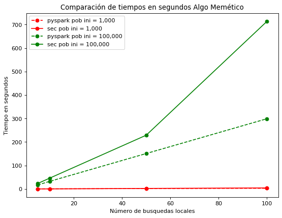
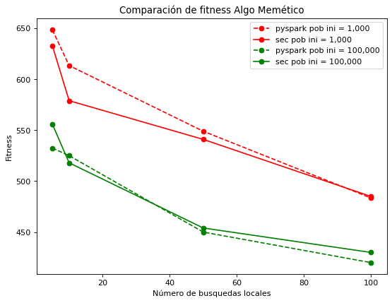

# Implementation of genetic algorithm using a distributed workload for solving the TSP

This jupyter contains two implementations using Python of a function that solves the Traveling Salesman Problem (a.k.a TSP) using a genetic algorithm and then improves the solution found through a memetic algorithm.

The first implementation is done using a sequential architecture and the second implementation uses PySpark to use a distributed workload. There is also a section devoted to compare both implementations, in which it can be seen that different parts of the algorithm perform better under a distributed workloads and other parts don't. 

The following graph shows the difference between the execution time using the sequential and the distributed implementation with two different sizes of populations. The improvement in run time is noticeable when the selected population size is big.

The following graph shows the difference between the fitness (i.e. the quality of the solution) of the two implementations. It can also be noted that there is an improvement (but not as noticeable) when using the distributed implementation.

This project was created by José Duarte and Yair Castillo
